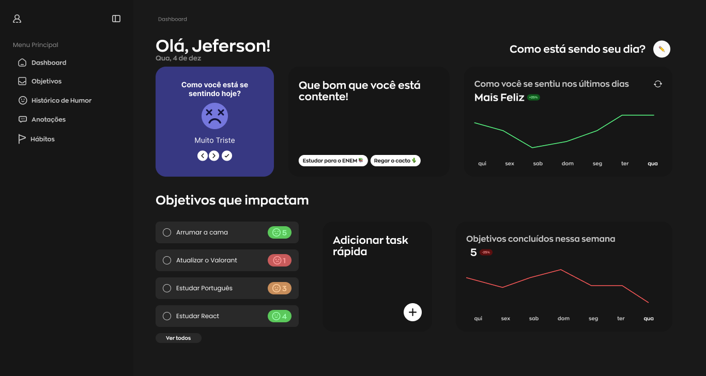
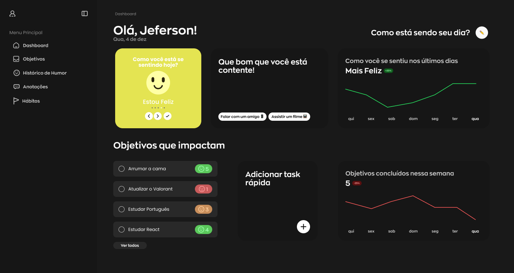
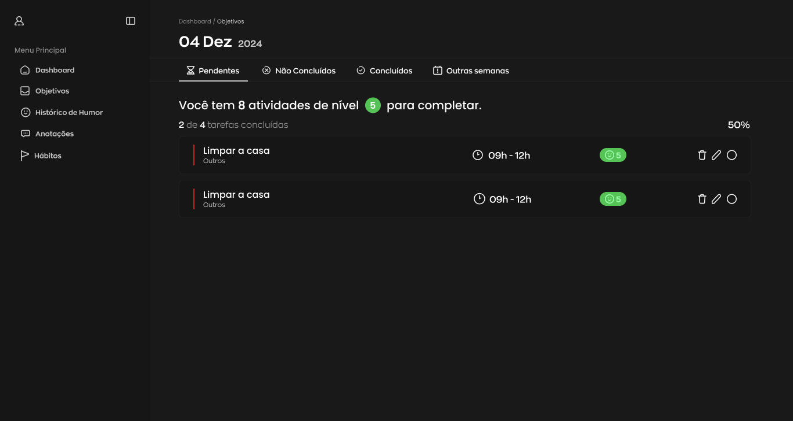

# 🎭 **Reflexa**

O **Reflexa** é uma aplicação em que você pode acompanhar estatística de como você vem se sentindo e fazer anotações de metas para cumprí-las ao decorrer da semana, no final, você ainda consegue ter uma análise de como foi a semana e quantas tasks cumpriu.

## 🔗 **Índice**

- [🚀 Tecnologias Utilizadas](#-tecnologias-utlizadas)
  - [💻 Front End](#-front-end)
  - [💾 Back End](#-back-end)
- [🚧 Atualizações Futuras](#-atualizações-futuras)

## 🚀 Tecnologias Utilizadas

### **💻 Front End**

- **Javascript / Typescrit** - Utilizado para tipagem estática e outras funcionalidades.

- **Tailwind** - Framework CSS utilitário que permite a criação de designs responsivos de forma rápida e flexível, usando classes predefinidas para estilizar os componentes.

- **React** - Utilizada para construir interfaces de usuário. Utilizada no projeto para criar componentes reutilizáveis e dinâmicos, facilitando o desenvolvimento e manutenção da UI.

  - 📚 **Bibliotecas**
    - React Router - Biblioteca de roteamento para React. Utilizada para gerenciar a navegação entre diferentes páginas ou componentes em aplicações single-page (SPA).

### **💾 Back End**

- O back-end do projeto ainda será implementado. A intenção é utilizar **Express** para criar uma API que irá gerenciar as requisições e interação com o banco de dados. A implementação está planejada para uma atualização futura.

## 📷 UI

<strong>Dashboard</strong>

<strong>Tasks</strong>

## 🚧 Atualizações Futuras

Este projeto ainda está em desenvolvimento e contará com as seguintes melhorias em breve:

- Implementação do Back End: Criar uma API para gerencimanto de novos objetivos;
- Integração com **Docker** e uma **ORM**.

## 👥 Fale comigo!

Achou meu repertório interessante e gostaria de contratar um freela ou talvez me contratar para tornar acrescenter no seu negócio? Entre em contato comigo e vamos marcar.

  
  

